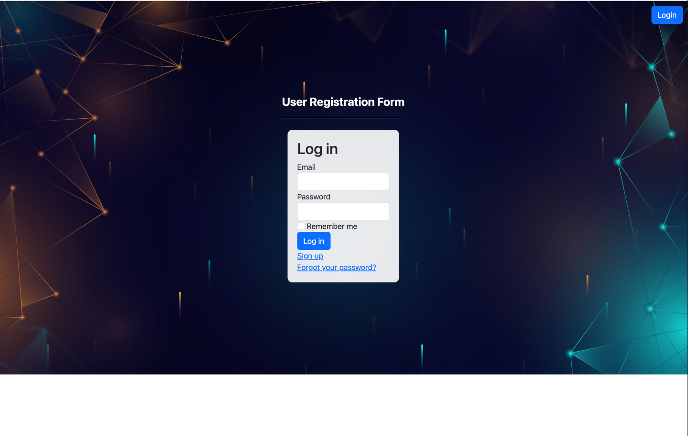
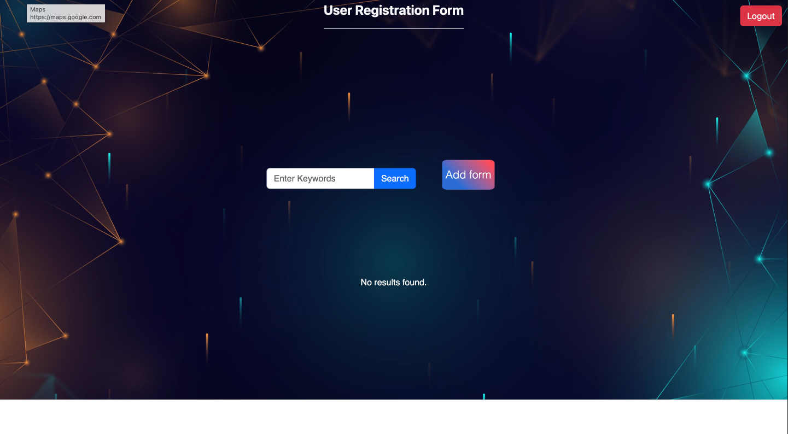
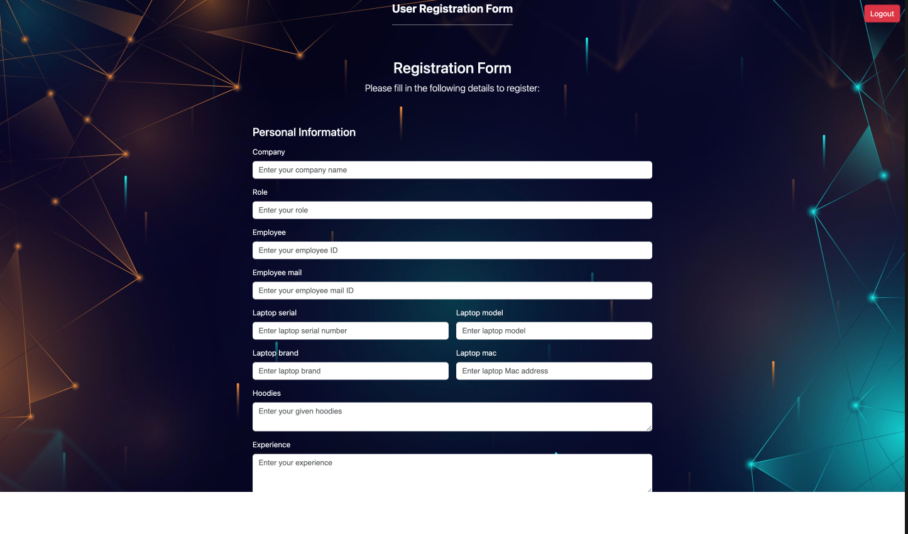

# User Registration Form Application

## Description

The User Registration Form Application is a web application that allows users to sign up and log in. Once logged in, users are redirected to the home page, which includes a search box and an "Add Form" button. Clicking the "Add Form" button takes users to the personal details page, where they can provide their personal information. After entering the personal details, users can click the "Next" button to move to the address page, where they provide their address information. Finally, when the user clicks the "Submit" button, the data is inserted into the database, and they are redirected to the index page. On the index page, users can search for data, and the search results are displayed in a table.

## Table of Contents

- [Getting Started](#getting-started)
  - [Prerequisites](#prerequisites)
  - [Installation](#installation)
- [Usage](#usage)
  - [Signup and Login](#signup-and-login)
  - [Index Page](#index-page)
  - [Personal Details Page](#personal-details-page)
  - [Address Page](#address-page)
  - [Data Insertion](#data-insertion)
 
- [Contributing](#contributing)
- [License](#license)

## Getting Started

### Prerequisites

Make sure you have the following installed on your system:

- Ruby 2.7.4
- Rails 6.1.4
- PostgreSQL Database

### Installation

Follow these steps to install and set up the application:

1. Clone the repository: `git clone https://github.com/your-username/user-registration-form.git`
2. Change into the project directory: `cd user-registration-form`
3. Install gem dependencies: `bundle install`
4. Set up the database: `rails db:setup`
5. Start the Rails server: `rails server`

## Usage

### Signup and Login

1. Open the application in your web browser.
2. Click on the "Sign Up" link to create a new account or click on the "Login" link to access an existing account.
3. Provide the required information, such as username, email, and password, to sign up or log in.

### Index Page

1. After logging in, you will be redirected to the Index page.
2. The Index page features a search box where you can enter keywords for searching data.
3. Click on the "Add Form" button to proceed to the personal details page.
4. On the index page, you can use the search box to search for specific data.
5. The search results will be displayed in a table format.

### Personal Details Page

1. On the personal details page, enter your personal information, such as name, age, and contact details.
2. Click the "Next" button to move to the address page.

### Address Page

1. Enter your address details, such as street address, city, and postal code.
2. Click the "Next" button to proceed to the data insertion.

### Data Insertion

1. Review all the entered information on the confirmation page.
2. If everything looks correct, click the "Submit" button to insert the data into the database.

## Contributing

We welcome contributions to the User Registration Form Application. To contribute, follow these steps:

1. Fork the repository on GitHub.
2. Create a new branch with a descriptive name for your feature or bug fix.
3. Make changes and commit them with clear commit messages.
4. Push your changes to your forked repository.
5. Submit a pull request, and we will review your changes.

## License

This project is Done by jothiswaran

