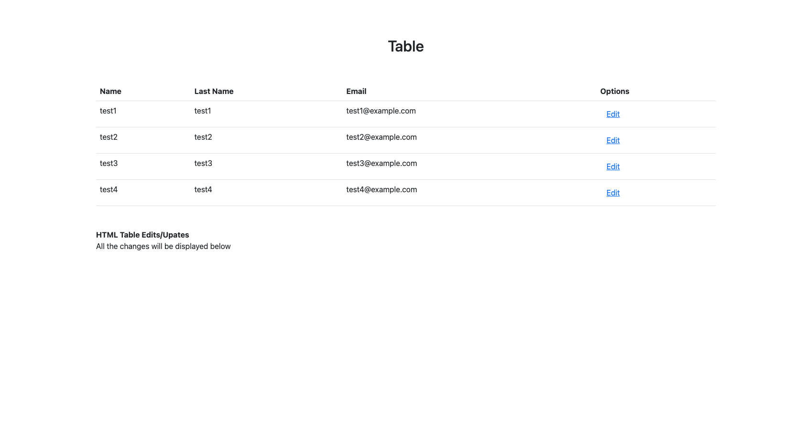
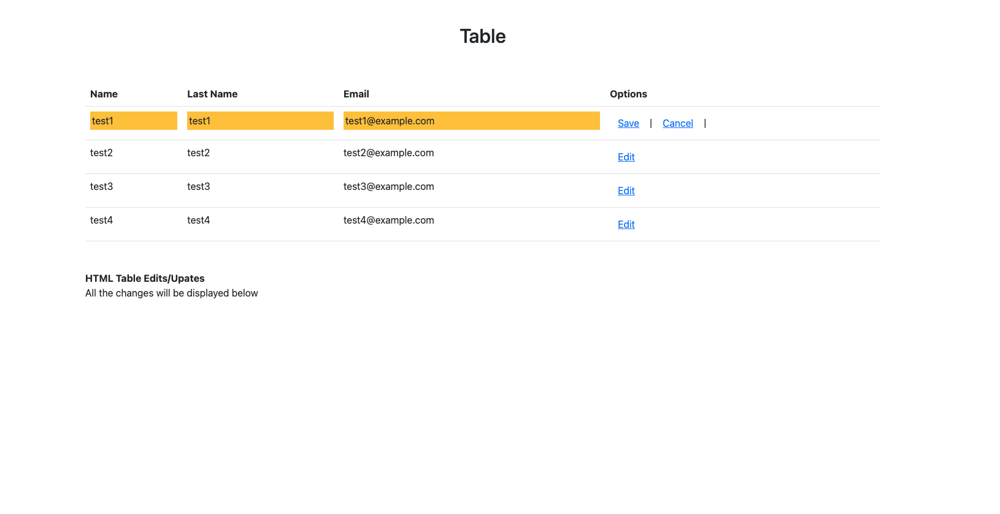
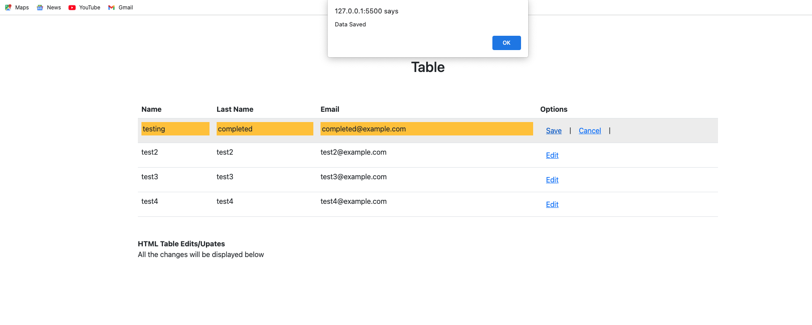
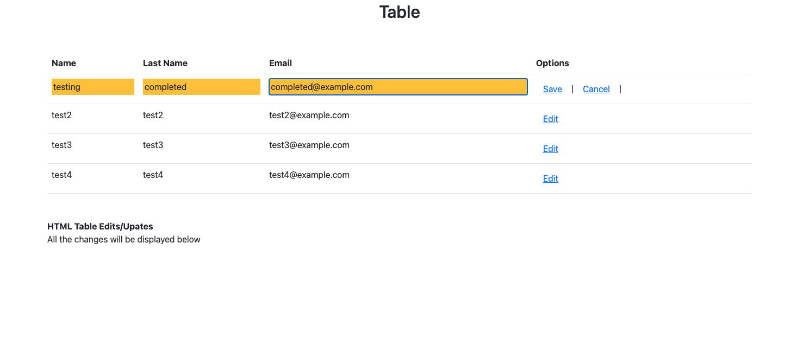
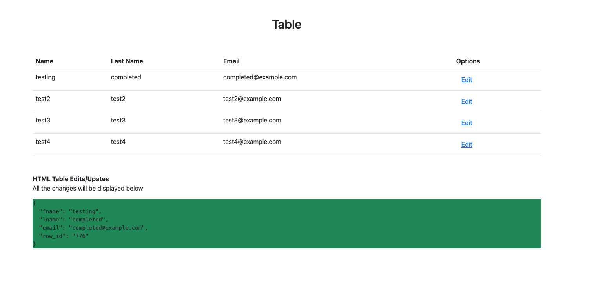

# HTML Table Edits/Updates

This is a simple HTML page that demonstrates editing and updating table data. The page uses jQuery and Bootstrap for the UI components.

## Table Preview

## How to Use

1. Open the HTML page in a web browser.
2. The table will be displayed with sample data.
3. Click on any cell to make it editable.
4. Edit the cell data and press Enter or click outside the cell to save the changes.
5. The updated data will be displayed below the table.

## Screenshots

### Edit Cell Data

### Save Changes

### Edit all cells in the table

### Data Update Confirmation

## Author

Created by Jothiswaran

Feel free to explore and modify the code according to your requirements.

