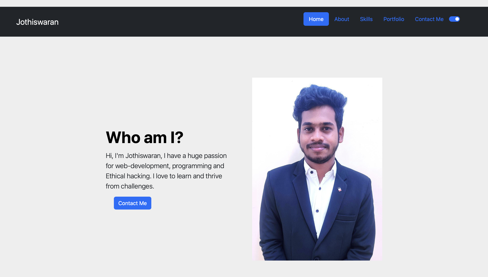
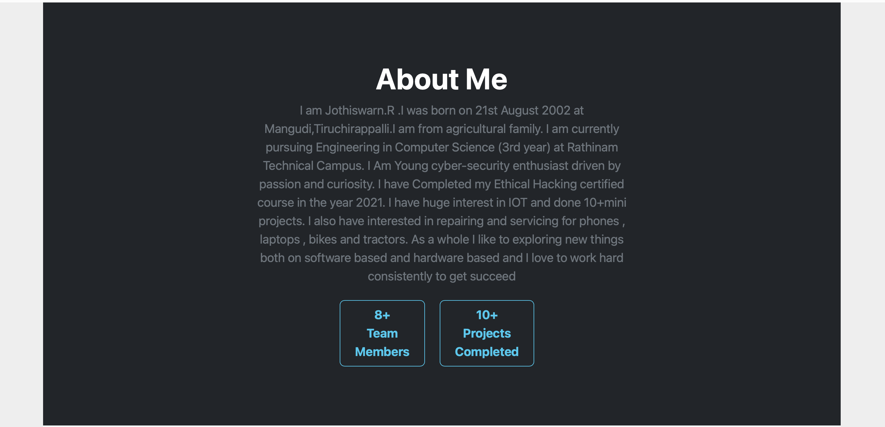
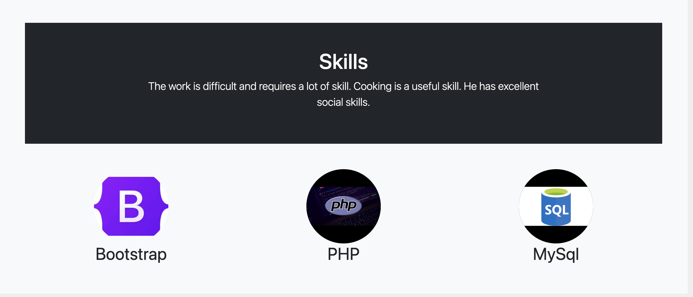
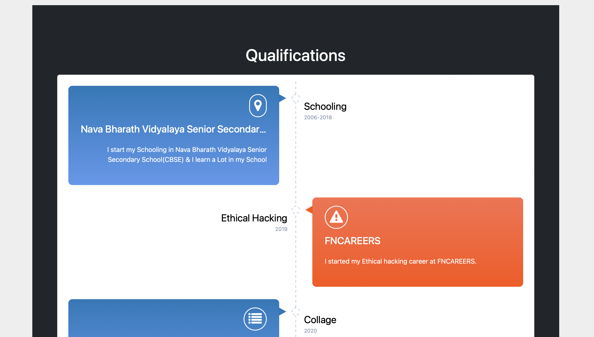

# Portfolio

This is a portfolio website that showcases various sections including home, about, skills, qualifications, and portfolio. It aims to provide an overview of the individual's experience, skills, and projects.

## Sections

The portfolio website consists of the following sections:

1. **Home**: The landing page that provides a brief introduction and highlights the key areas of expertise.
2. **About**: A section that provides detailed information about the individual, including their background, education, and personal interests.
3. **Skills**: A section that lists the technical and professional skills possessed by the individual.
4. **Qualifications**: An overview of the individual's qualifications, certifications, and achievements.
5. **Portfolio**: A showcase of the individual's projects, including descriptions, screenshots, and links to the live demos or repositories.

## Demo

Images/GIFs showcasing the different sections and features of the portfolio website:

**Home:**



**About:**



**Skills:**



**Qualifications:**



**Portfolio:**


## Installation

1. Clone the repository:

   ```bash
   git clone https://github.com/your-username/portfolio.git
   cd portfolio
2.Open the index.html file in your preferred web browser.
Usage
Once the website is running in your browser, you can navigate through the different sections by clicking on the corresponding links in the navigation menu or using the navigation buttons within each section.

Feel free to explore the portfolio, read about the individual's background, skills, qualifications, and check out their showcased projects in the portfolio section.

Technologies Used
HTML5
CSS3
JavaScript
Contributing
Contributions are welcome! If you have any improvements or bug fixes, feel free to submit a pull request. Please make sure to follow the code styling and conventions used in the project.